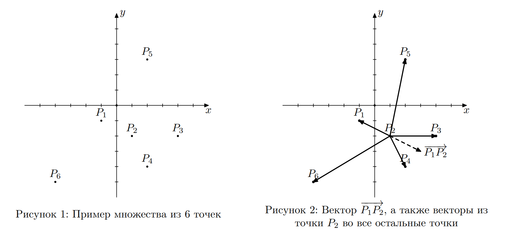

## Условие:
Рассмотрим n точек на плоскости, пронумерованных от 1 до n, обозначим их как $P_1, P_2, . . . , P_n$, координаты i-й точки (xi, yi).

Рассмотрим следующий процесс. Выберем номер начальной точки i и номер следующей за ней точки j (i != j), а также целое число t. После этого номер прицельной точки k вычисляется по следующему алгоритму. Рассмотрим вектор $P_iP_j$ , направленный из точки $P_i$ в точку $P_j$ . Упорядочим все точки, кроме j-й, по углу, отсчитывая против часовой стрелки от направления вектора, равного P_iP_j , отложенного из точки j. При равенстве угла будем упорядочивать точки по возрастанию расстояния до точки j. В качестве точки k выбирается точка, являющаяся t-й в данном порядке при нумерации с единицы. Далее точка j становится начальной, а точка k — следующей за ней, после чего, пользуясь тем же алгоритмом, вычисляется номер прицельной точки. Этот процесс повторяется до бесконечности.

Для лучшего понимания процесса рассмотрим следующий пример. Пусть имеются 6 точек, изображенных на рисунке 1, а t = 4. Пусть номер начальной точки равен 1, а номер следующей за ней точки равен 2. Отложим вектор $P_1P_2$ от точки $P_2$ и отсортируем все точки, кроме точки $P_2$, по углу, отсчитывая против часовой стрелки от направления данного вектора. На рисунке 2 отложенный вектор обозначен пунктирной линией, а также для удобства проведены векторы из точки $P_2$ во все остальные точки.
Точки будут упорядочены следующим образом: $P_3, P_5, P_1, P_6, P_4$. Таким образом, номер прицельной точки равен 6. Далее точка 2 становится начальной, а точка 6 — следующей.

На рисунке 3 изображен процесс для начальной точки 2 и следующей точки 6. Точки будут упорядочены следующим образом: $P_4, P_3, P_2, P_1, P_5$. Обратите внимание, что точка $P_1$ в этом списке находится раньше, чем точка $P_5$, так как расстояние от точки $P_1$ до точки $P_6$ меньше, чем расстояние от точки $P_5$ до точки $P_6$. Прицельная точка будет иметь номер 1.

На рисунке 4 изображен процесс для начальной точки 6 и следующей точки 1. Обратите внимание, что в данном случае вектор $P_6P_1$, отложенный из точки $P_1$ совпадает с вектором $P_1P_5$, отложенным из точки $P_1$. Эти векторы изображены сплошной линией. Точки будут упорядочены следующим образом: $P_5, P_6, P_4, P_2, P_3$. Прицельная точка будет иметь номер 2. Таким образом, далее процесс начнется для начальной точки 1 и следующей точки 2 и зациклится.

Покрасим каждую из n точек в один из трех цветов. Цвет i-й точки определяется следующим образом:
- Пусть существует такая точка j, что, выбрав точку i в качестве начальной, а точку j в качестве следующей, в результате описанного процесса точка i побывает начальной бесконечное количество раз. В этом случае точка i будет покрашена в зеленый цвет.
- Пусть точка i не была покрашена в зеленый цвет и существует такая точка j, что, выбрав точку i в качестве начальной, а точку j в качестве следующей, в результате описанного процесса точка i побывает начальной еще хотя бы один раз. В этом случае точка i будет покрашена в синий цвет.
- Пусть точка i не была покрашена ни в зеленый, ни в синий цвет. В этом случае точка i будет покрашена в красный цвет.

Для каждой точки определите, в какой цвет ее нужно покрасить.

## Входные данные:
Первая строка содержит два целых числа n и t (2 <= n <= 1000, 1 <= t <= n − 1).
Каждая из следующих n строк содержит два целых числа $x_i$ и $y_i$ ($−10^9 <= x_i, y_i <= 10^9$). Гарантируется, что никакие две точки не совпадают.

## Выходные данные:
Выведите строку, состоящую из n символов: i-й символ строки должен обозначать цвет i-й точки.
Для зеленой точки выведите букву «G», для синей точки — букву «B», а для красной точки — букву «R».