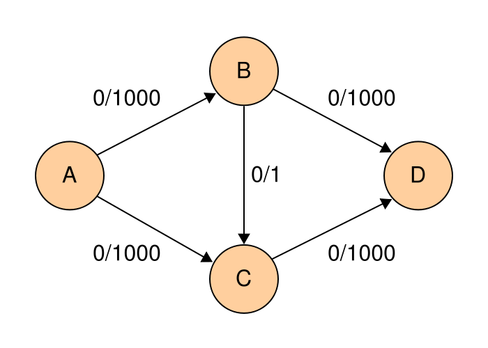

# Теория по алгоритмам:

## 1. Обходы гррафа

### 1.1. Ориентированный граф, псевдограф. Неориентированный граф, псевдограф. Связность в неор. графе, компоненты связности. Слабая и сильная связность в ор. графе. Компоненты слабой, сильной связности.

#### Ориентированный граф.

1. `Ориентированным графом` (англ. directed graph) G называется пара $G = (V,E)$, где $V$ — множество вершин (англ. vertices), а $E⊂V×V$ — множество рёбер.

2. Мультиорграф(`Псевдограф`) — это ориентированный граф, в котором разрешены кратные дуги, то есть дуги, имеющие те же начальные и конечные вершины. 
Мультиорграфом $G$ называется упорядоченная пара $G:=(V,A)$, в которой $V$ — множество вершин, $A$ — мультимножество упорядоченных пар вершин. Элементы этого множества называются дугами.

3. Ориентированный граф называется `слабо связным`, если соответствующий неориентированный граф является связным;
4. Ориентированный граф называется `сильно связным`, если всякая вершина $v$ достижима из любой другой вершины $v$;
5. `Компонентой сильной связности` ориентированного графа называется максимальный по включению сильно связный подграф. Другими словами, это подграф, любые две вершины которого принадлежат какому-либо циклу, и содержащий все такие циклы для своих вершин.
6. `Компонентой слабой связности` ориентированного графа называют его максимальный слабо связный подграф.

#### Неориентированный граф.

1. `Неориентированным графом` (англ. undirected graph) $G$ называется пара $G = (V,E)$, где $V$ — множество вершин, а $E⊂{{v,u}:v,u ∈V}$ — множество рёбер.

2. Формально, мультиграфом(`псевдографом`) $G$ называется упорядоченная пара $G:=(V, E)$, в которой $V$ — множество вершин, $E$ — мультимножество неупорядоченных пар вершин. Элементы этого множества называются рёбрами.

3. Неориентированный граф называется `связным`, если все его вершины достижимы из некоторой вершины (эквивалентно, из любой его вершины).

4. `Компонентой связности` неориентированного графа называется максимальный по включению связный подграф.

### 1.2. Обход в глубину. Цвета вершин. Времена входа и выхода. Лемма о белых путях(с доказательством).

#### Обход в глубину.

Пусть задан граф $G=(V,E)$, где $V$ — множество вершин графа, $E$ — множество ребер графа. Предположим, что в начальный момент времени все вершины графа окрашены в белый цвет. Выполним следующие действия:

- Пройдём по всем вершинам $v ∈ V$. 
    1. Если вершина $v$ белая, выполним для неё **DFS(v)**.

- Процедура **DFS** (параметр — вершина $u ∈ V$
    1. Перекрашиваем вершину $u$ в серый цвет.
    2. Для всякой вершины $w$, смежной с вершиной $u$ и окрашенной в белый цвет, рекурсивно выполняем процедуру **DFS(w)**.
    3. Перекрашиваем вершину $u$ в чёрный цвет.

```c++
vector < vector<int> > g; // граф
int n; // число вершин

vector<int> color; // цвет вершины (0, 1, или 2)

vector<int> time_in, time_out; // "времена" захода и выхода из вершины
int dfs_timer = 0; // "таймер" для определения времён

void dfs (int v) {
	time_in[v] = dfs_timer++;
	color[v] = 1;
	for (vector<int>::iterator i=g[v].begin(); i!=g[v].end(); ++i)
		if (color[*i] == 0)
			dfs (*i);
	color[v] = 2;
	time_out[v] = dfs_timer++;
}
```

####  Лемма о белых путях.

- Лемма: Не существует такого момента выполнения поиска в глубину, в который бы существовало ребро из черной вершины в белую.
- Доказательство: Пусть в процессе выполнения процедуры **dfs** нашлось ребро из черной вершины $v$ в белую вершину $u$. Рассмотрим момент времени, когда мы запустили **dfs(v)**. В этот момент вершина $v$ была перекрашена из белого в серый, а вершина $u$ была белая. Далее в ходе выполнения алгоритма будет запущен **dfs(u)**, поскольку обход в глубину обязан посетить все белые вершины, в которые есть ребро из $v$. По алгоритму вершина $v$ будет покрашена в черный цвет тогда, когда завершится обход всех вершин, достижимых из нее по одному ребру, кроме тех, что были рассмотрены раньше нее. Таким образом, вершина $v$ может стать черной только тогда, когда **dfs** выйдет из вершины $u$, и она будет покрашена в черный цвет. Получаем противоречие.


### 1.3. Проверка связности неориентированного графа. Поиск цикла в неориентированном и ориентированном графе. Топологическая сортировка.

#### Проверка связности неориентированного графа.

Небольшая модификация алгоритма обхода в глубину, в которой будем возвращать количество посещенных вершин. Запустим такой **dfs()** от некоторой вершины графа $G$, если его результат равен $|V|$, то мы побывали во всех вершинах графа, а следовательно он связен, иначе какие-то вершины остались непосещенными. Работает алгоритм за $O(|V|+|E|)$.

```c++
// visited — массив цветов вершин  
int dfs(u: int, visited: bool[]):              
    int visitedVertices = 1
    visited[u] = true                           // помечаем вершину как пройденную
    for v: uv ∈ E                               // проходим по смежным с u вершинам
        if not visited[v]                       // проверяем, не находились ли мы ранее в выбранной вершине
            visitedVertices += dfs(v, visited)
    return visitedVertices
```


#### Поиск цикла в неориентированном и ориентированном графе.

Пусть дан ориентированный или неориентированный граф без петель и кратных рёбер. Требуется проверить, является ли он ациклическим, а если не является, то найти любой цикл.

Произведём серию поисков в глубину в графе. Т.е. из каждой вершины, в которую мы ещё ни разу не приходили, запустим поиск в глубину, который при входе в вершину будет красить её в серый цвет, а при выходе - в чёрный. И если поиск в глубину пытается пойти в серую вершину, то это означает, что мы нашли цикл (если граф неориентированный, то случаи, когда поиск в глубину из какой-то вершины пытается пойти в предка, не считаются).

```c++
int n;
vector < vector<int> > g;
vector<char> cl;
vector<int> p;
int cycle_st, cycle_end;

bool dfs (int v) {
	cl[v] = 1;
	for (size_t i=0; i<g[v].size(); ++i) {
		int to = g[v][i];
		if (cl[to] == 0) {
			p[to] = v;
			if (dfs (to))  return true;
		}
		else if (cl[to] == 1) {
			cycle_end = v;
			cycle_st = to;
			return true;
		}
	}
	cl[v] = 2;
	return false;
}

int main() {
	... чтение графа ...

	p.assign (n, -1);
	cl.assign (n, 0);
	cycle_st = -1;
	for (int i=0; i<n; ++i)
		if (dfs (i))
			break;

	if (cycle_st == -1)
		puts ("Acyclic");
	else {
		puts ("Cyclic");
		vector<int> cycle;
		cycle.push_back (cycle_st);
		for (int v=cycle_end; v!=cycle_st; v=p[v])
			cycle.push_back (v);
		cycle.push_back (cycle_st);
		reverse (cycle.begin(), cycle.end());
		for (size_t i=0; i<cycle.size(); ++i)
			printf ("%d ", cycle[i]+1);
	}
}
```

#### Топологическая сортировка.

Дан ориентированный граф с $n$ вершинами и m рёбрами. Требуется перенумеровать его вершины таким образом, чтобы каждое рёбро вело из вершины с меньшим номером в вершину с большим. Иными словами, требуется найти перестановку вершин (топологический порядок), соответствующую порядку, задаваемому всеми рёбрами графа.
(`Топологическая сортировка` — упорядочивание вершин ациклического ориентированного графа согласно частичному порядку, заданному ребрами орграфа на множестве его вершин.)
Топологическая сортировка может быть не единственной (например, если граф — пустой; или если есть три такие вершины $a, b, c$, что из $a$ есть пути в $b$ и в $c$, но ни из $b$ в $c$, ни из $c$ в $b$ добраться нельзя).

Топологической сортировки может не существовать вовсе — если граф содержит циклы (поскольку при этом возникает противоречие: есть путь и из одной вершины в другую, и наоборот).
```c++
int n; // число вершин
vector<int> g[MAXN]; // граф
bool used[MAXN];
vector<int> ans;
 
void dfs (int v) {
	used[v] = true;
	for (size_t i=0; i<g[v].size(); ++i) {
		int to = g[v][i];
		if (!used[to])
			dfs (to);
	}
	ans.push_back (v);
}
 
void topological_sort() {
	for (int i=0; i<n; ++i)
		used[i] = false;
	ans.clear();
	for (int i=0; i<n; ++i)
		if (!used[i])
			dfs (i);
	reverse (ans.begin(), ans.end());
}
```

### 1.4. Нахождение компонент сильной связности. Алгоритм Косарайю с доказательством корректности(концепция). Алгоритм Тарьяна без доказательства корректности.

#### Нахождение компонент сильной связности.

Дан ориентированный граф $G$, множество вершин которого $V$ и множество рёбер — $E$. Петли и кратные рёбра допускаются. Обозначим через $n$ количество вершин графа, через $m$ — количество рёбер.

Напомним, что `компонентой сильной связности` (strongly connected component) называется такое (максимальное по включению) подмножество вершин $C$, что любые две вершины этого подмножества достижимы друг из друга, т.е. для любых $u,v$ из $C$: $u -> v$, $v -> u$, где символом $->$ здесь и далее мы будем обозначать достижимость, т.е. существование пути из первой вершины во вторую. Понятно, что компоненты сильной связности для данного графа не пересекаются, т.е. фактически это разбиение всех вершин графа. Отсюда логично определение конденсации $G$ как графа, получаемого из данного графа сжатием каждой компоненты сильной связности в одну вершину. Каждой вершине графа конденсации соответствует компонента сильной связности графа $G$, а ориентированное ребро между двумя вершинами $C_i$ и $C_j$ графа конденсации проводится, если найдётся пара вершин $u$ из $C_i$, из $C_j$, между которыми существовало ребро в исходном графе, т.е. $(u,v)$ из $E$.

Важнейшим свойством графа конденсации является то, что он ацикличен. Действительно, предположим, что $C -> C'$, докажем, что $C' !-> C$. Из определения конденсации получаем, что найдутся две вершины $u$ из $C$ и $v$ из $C'$, что $u -> v$. Доказывать будем от противного, т.е. предположим, что $C' -> C$, тогда найдутся две вершины $u'$ из $C$ и $v'$ из $C'$, что $v'$ -> $u'$. Но т.к. $u$ и $u'$ находятся в одной компоненте сильной связности, то между ними есть путь; аналогично для $v$ и $v'$. В итоге, объединяя пути, получаем, что $v -> u$, и одновременно $u -> v$. Следовательно, $u$ и $v$ должны принадлежать одной компоненте сильной связности, т.е. получили противоречие, что и требовалось доказать.

#### Алгоритм Косарайю с доказательством корректности(концепция).

- Алгоритм Косарайю предназначен для поиска компонент сильной связности в ориентированном графе и состоит из трёх шагов:

    1. Выполнить поиск в глубину (**DFS**), пока не будут «помечены» все вершины. Вершина считается «помеченной», когда ей присвоено время выхода из рекурсии (см. основные понятия).

    2. Инвертировать исходный граф

    3. Выполнить **DFS** в порядке убывания пометок вершин.

Полученные деревья каждого такта **DFS** последнего шага являются компонентами сильной связности

- Доказательство корректности алгоритма. Немного уточним, что требуется доказать: Вершины $u$ и $v$ сильно связаны ⇔ после выполнения алгоритма они принадлежат одному дереву такта **DFS**.

    Если вершины $u$ и $v$ были сильно связаны в графе $G$, на третьем этапе будет найден путь из одной вершины в другую (по Лемме (Инвертирование рёбер цикла не влияет на его цикличность)), так как на первом шаге был найден путь $u→v$, а на третьем путь $v→u$. Это означает, что по окончании алгоритма обе вершины лежат в одном дереве.

    Вершины $u$ и $v$ лежат в одном и том же дереве поиска в глубину на третьем шаге алгоритма. Значит, они обе достижимы из корня $r$ этого дерева.

    Вершина $r$ была рассмотрена на 3 шаге раньше всех, значит время выхода из неё на 1 шаге больше, чем время выхода из вершин $u$ и $v$. Из этого мы получаем 2 случая:

    Обе эти вершины были достижимы из $r$ в исходном графе. Это означает сильную связность вершин $u$ и $r$ и сильную связность вершин $v$ и $r$ (по Лемме 3). Склеивая пути мы получаем связность вершин $u$ и $v$.

    Хотя бы одна вершина не достижима из $r$ в исходном графе, например $v$. Значит и $r$ была не достижима из $v$ в исходном графе, так как время выхода из $r$ — больше (если бы она была достижима, то время выхода из $v$ было бы больше, чем из $r$, просмотрите ещё раз первый шаг примера). Значит между этими вершинами нет пути (ни в исходном, ни в инвертированном графах), но последнего быть не может, потому что по условию $v$ достижима из $r$ на 3 шаге (в инвертированном графе)

    Значит, из случая 1 и не существования случая 2 получаем, что вершины $u$ и $v$ сильно связаны в обоих графах


#### Алгоритм Тарьяна без доказательства корректности.
Основой для алгоритма является структура данных "Система непересекающихся множеств", которая и была изобретена Тарьяном (Tarjan).

Алгоритм фактически представляет собой обход в глубину из корня дерева, в процессе которого постепенно находятся ответы на запросы. А именно, ответ на запрос $(v,u)$ находится, когда обход в глубину находится в вершине $u$, а вершина $v$ уже была посещена, или наоборот.

Итак, пусть обход в глубину находится в вершине $v$ (и уже были выполнены переходы в её сыновей), и оказалось, что для какого-то запроса $(v,u)$ вершина $u$ уже была посещена обходом в глубину. Научимся тогда находить $LCA$ этих двух вершин.

Заметим, что $LCA(v,u)$ является либо самой вершиной $v$, либо одним из её предков. Получается, нам надо найти самую нижнюю вершину среди предков $v$ (включая её саму), для которой вершина $u$ является потомком. Заметим, что при фиксированном $v$ по такому признаку (т.е. какой наименьший предок v является и предком какой-то вершины) вершины дерева дерева распадаются на совокупность непересекающихся классов. Для каждого предка $p != v$ вершины $v$ её класс содержит саму эту вершину, а также все поддеревья с корнями в тех её сыновьях, которые лежат "слева" от пути до $v$ (т.е. которые были обработаны ранее, чем была достигнута $v$).

Нам надо научиться эффективно поддерживать все эти классы, для чего мы и применим структуру данных "Система непересекающихся множеств". Каждому классу будет соответствовать в этой структуре множество, причём для представителя этого множества мы определим величину $ANCESTOR$ — ту вершину $p$, которая и образует этот класс.

Рассмотрим подробно реализацию обхода в глубину. Пусть мы стоим в некоторой вершине v. Поместим её в отдельный класс в структуре непересекающихся множеств, $ANCESTOR[v] = v$. Как обычно в обходе в глубину, перебираем все исходящие рёбра $(v, to)$. Для каждого такого $to$ мы сначала должны вызвать обход в глубину из этой вершины, а потом добавить эту вершину со всем её поддеревом в класс вершины $v$. Это реализуется операцией **Union** структуры данных "система непересекающихся множеств", с последующей установкой **ANCESTOR** = $v$ для представителя множества (т.к. после объединения представитель класса мог измениться). Наконец, после обработки всех рёбер мы перебираем все запросы вида $(v,u)$, и если $u$ была помечена как посещённая обходом в глубину, то ответом на этот запрос будет вершина $LCA(v,u)$ = **ANCESTOR**[FindSet($u$)]. Нетрудно заметить, что для каждого запроса это условие (что одна вершина запроса является текущей, а другая была посещена ранее) выполнится ровно один раз.

Оценим асимптотику. Она складывается из нескольких частей. Во-первых, это асимптотика обхода в глубину, которая в данном случае составляет $O(n)$. Во-вторых, это операции по объединению множеств, которые в сумме для всех разумных $n$ затрачивают $O(n)$ операций. В-третьих, это для каждого запроса проверка условия (два раза на запрос) и определение результата (один раз на запрос), каждое, опять же, для всех разумных n выполняется за $O(1)$. Итоговая асимптотика получается O(n+m), что означает для достаточно больших $m (n = O(m))$ ответ за $O(1)$ на один запрос.


### 1.5. Компоненты реберной двусвязности. Мосты. Поиск мостов.

#### Компоненты реберной двусвязности.

`Компонентами рёберной двусвязности` (англ. costal doubly-linked components) графа называют его подграфы, множества вершин которых - классы эквивалентности рёберной двусвязности, а множества рёбер - множества ребер из соответствующих классов эквивалентности.


#### Мосты.

`Мостом` называется такое ребро, удаление которого делает граф несвязным (или, точнее, увеличивает число компонент связности). 

#### Поиск мостов.

- Алгоритм: 
    Запустим обход в глубину из произвольной вершины графа; обозначим её через **root**. Заметим следующий факт (который несложно доказать):

    Пусть мы находимся в обходе в глубину, просматривая сейчас все рёбра из вершины $v$. Тогда, если текущее ребро $(v,to)$ таково, что из вершины $to$ и из любого её потомка в дереве обхода в глубину нет обратного ребра в вершину $v$ или какого-либо её предка, то это ребро является мостом. В противном случае оно мостом не является. (В самом деле, мы этим условием проверяем, нет ли другого пути из $v$ в $to$, кроме как спуск по ребру $(v,to)$ дерева обхода в глубину.)
    Теперь осталось научиться проверять этот факт для каждой вершины эффективно. Для этого воспользуемся "временами входа в вершину", вычисляемыми алгоритмом поиска в глубину.

    Итак, пусть $tin[v]$ — это время захода поиска в глубину в вершину $v$. Теперь введём массив $fup[v]$, который и позволит нам отвечать на вышеописанные запросы. Время $fup[v]$ равно минимуму из времени захода в саму вершину $tin[v]$, времён захода в каждую вершину $p$, являющуюся концом некоторого обратного ребра $(v,p)$, а также из всех значений $fup[to]$ для каждой вершины $to$, являющейся непосредственным сыном $v$ в дереве поиска:

    $fup[v] = min{ tin[v], tin[p], fup(to)} (v, p)$ - back edge, $(v, to)$ - tree edge (здесь "back edge" — обратное ребро, "tree edge" — ребро дерева)

    Тогда, из вершины $v$ или её потомка есть обратное ребро в её предка тогда и только тогда, когда найдётся такой сын $to$, что $fup[to] <= tin[v]$. (Если $fup[to] = tin[v]$, то это означает, что найдётся обратное ребро, приходящее точно в $v$; если же $fup[to] < tin[v]$, то это означает наличие обратного ребра в какого-либо предка вершины $v$.)

    Таким образом, если для текущего ребра $(v,to)$ (принадлежащего дереву поиска) выполняется $fup[to] > tin[v]$, то это ребро является мостом; в противном случае оно мостом не является.


### 1.6. Компоненты вершинной двусвязности. Точки сочленения. Поиск точек сочленения.

#### Компоненты вершинной двусвязности.

`Компонентами вершинной двусвязности` графа, называют его подграфы, множества ребер которых — классы эквивалентности вершинной двусвязности, а множества вершин — множества всевозможных концов ребер из соответствующих классов.

#### Точки сочленения.

`Точкой сочленения` называется вершина, при удалении которой связный неориентированный граф становится несвязным.

#### Поиск точек сочленения.

- Алгоритм: 
    Запустим обход в глубину из произвольной вершины графа; обозначим её через **root**. Заметим следующий факт (который несложно доказать):

    Пусть мы находимся в обходе в глубину, просматривая сейчас все рёбра из вершины $v$ != **root**. Тогда, если текущее ребро $(v,to)$ таково, что из вершины $to$ и из любого её потомка в дереве обхода в глубину нет обратного ребра в какого-либо предка вершины $v$, то вершина $v$ является точкой сочленения. В противном случае, т.е. если обход в глубину просмотрел все рёбра из вершины $v$, и не нашёл удовлетворяющего вышеописанным условиям ребра, то вершина $v$ не является точкой сочленения. (В самом деле, мы этим условием проверяем, нет ли другого пути из $v$ в $to$)
    Рассмотрим теперь оставшийся случай: $v$ = **root**. Тогда эта вершина является точкой сочленения тогда и только тогда, когда эта вершина имеет более одного сына в дереве обхода в глубину. (В самом деле, это означает, что, пройдя из **root** по произвольному ребру, мы не смогли обойти весь граф, откуда сразу следует, что **root** — точка сочленения).
    (Ср. формулировку этого критерия с формулировкой критерия для алгоритма поиска мостов.)

    Теперь осталось научиться проверять этот факт для каждой вершины эффективно. Для этого воспользуемся "временами входа в вершину", вычисляемыми алгоритмом поиска в глубину.

    Итак, пусть $tin[v]$ — это время захода поиска в глубину в вершину $v$. Теперь введём массив $fup[v]$, который и позволит нам отвечать на вышеописанные запросы. Время $fup[v]$ равно минимуму из времени захода в саму вершину $tin[v]$, времён захода в каждую вершину $p$, являющуюся концом некоторого обратного ребра $(v,p)$, а также из всех значений $fup[to]$ для каждой вершины $to$, являющейся непосредственным сыном $v$ в дереве поиска:

    $fup[v] = min{tin[v], tin[p], fup(to)} (v, p)$ - back edge, $(v, to)$ - tree edge (здесь "back edge" — обратное ребро, "tree edge" — ребро дерева)

    Тогда, из вершины $v$ или её потомка есть обратное ребро в её предка тогда и только тогда, когда найдётся такой сын to, что $fup[to] < tin[v]$.

    Таким образом, если для текущего ребра $(v,to)$ (принадлежащего дереву поиска) выполняется $fup[to] >= tin[v]$, то вершина $v$ является точкой сочленения. Для начальной вершины $v$ = **root** критерий другой: для этой вершины надо посчитать число непосредственных сыновей в дереве обхода в глубину.


### 1.7. Волновой алгоритм. Обход в ширину (применение очереди в волновом алгоритме).

#### Волновой алгоритм.

`Алгоритм волновой трассировки (волновой алгоритм)` — алгоритм поиска пути, алгоритм поиска кратчайшего пути на планарном графе. Принадлежит к алгоритмам, основанным на методах поиска в ширину.

Алгоритм предназначен для поиска кратчайшего пути от стартовой ячейки к конечной ячейке, если это возможно, либо, при отсутствии пути, выдать сообщение о непроходимости[6].

Работа алгоритма включает в себя три этапа: инициализацию, распространение волны и восстановление пути.

- Инициализация
```c
Пометить стартовую ячейку 
d := 0 
```
- Распространение волны
```c
ЦИКЛ
  ДЛЯ каждой ячейки loc, помеченной числом d
    пометить все соседние свободные непомеченные ячейки числом d + 1
  КЦ
  d := d + 1
ПОКА (финишная ячейка не помечена) И (есть возможность распространения волны) 
```
- Восстановление пути

```c
ЕСЛИ финишная ячейка помечена
ТО
  перейти в финишную ячейку
  ЦИКЛ
    выбрать среди соседних ячейку, помеченную числом на 1 меньше числа в текущей ячейке
    перейти в выбранную ячейку и добавить её к пути
  ПОКА текущая ячейка — не стартовая
  ВОЗВРАТ путь найден
ИНАЧЕ
  ВОЗВРАТ путь не найден
```

#### Обход в ширину (применение очереди в волновом алгоритме).

- Поиск в ширину (англ. breadth-first search) — один из основных алгоритмов на графах, позволяющий находить все кратчайшие пути от заданной вершины и решать многие другие задачи.

- Описание алгоритма
    На вход алгоритма подаётся невзвешенный граф и номер стартовой вершины $s$. Граф может быть как ориентированным, так и неориентированным — для алгоритма это не важно.

    Основную идею алгоритма можно понимать как процесс «поджигания» графа: на нулевом шаге мы поджигаем вершину $s$, а на каждом следующем шаге огонь с каждой уже горящей вершины перекидывается на всех её соседей, в конечном счете поджигая весь граф.

    Если моделировать этот процесс, то за каждую итерацию алгоритма будет происходить расширение «кольца огня» в ширину на единицу. Номер шага, на котором вершина $v$ начинает гореть, в точности равен длине её минимального пути из вершины $s$.

```c++
vector<int> g[maxn];

void bfs(int s) {
    queue<int> q;
    q.push(s);
    
    vector<int> d(n, -1), p(n);
    d[s] = 0;
    
    while (!q.empty()) {
        int v = q.front();
        q.pop();
        for (int u : g[v]) {
            if (d[u] == -1) {
                q.push(u);
                d[u] = d[v] + 1;
                p[u] = v;
            }
        }
    }
} 
```

Теперь, чтобы восстановить кратчайший путь до какой-то вершины $v$, это можно сделать через массив $p$:
```c++
while (v != s) {
    cout << v << endl;
    v = p[v];
}
```
Обратим внимание, что путь выведется в обратном порядке.


### 1.8. Критерий существования Эйлерова пути и цикла в ориентированном и неориентированном графе. Поиск эйлерова пути и цикла.

##### Критерий существования Эйлерова пути и цикла в неориентированном графе.

- Согласно теореме, доказанной Эйлером, эйлеров цикл существует тогда и только тогда, когда 
    1. Граф связный или будет являться связным, если удалить из него все изолированные вершины.
    2. В нём отсутствуют вершины нечётной степени.

- Эйлеров путь в графе существует тогда и только тогда, когда 
    1. Граф связный
    2. Содержит не более двух вершин нечётной степени. Ввиду леммы о рукопожатиях, число вершин с нечётной степенью должно быть чётным. А значит эйлеров путь существует только тогда, когда это число равно нулю или двум. Причём, когда оно равно нулю, эйлеров путь вырождается в эйлеров цикл.

##### Критерий существования Эйлерова пути и цикла в ориентированном графе.
- В ориентированном графе $G=(V,E)$ существует эйлеров цикл тогда и только тогда, когда:
    1. Входная степень любой вершины равна ее выходной степени.
    2. Все компоненты слабой связности кроме, может быть одной, не содержат ребер.
- В ориентированном графе $G=(V,E)$ существует эйлеров путь если:
    1. Входная степень любой вершины равна ее выходной степени, кроме двух вершин графа, для одной из которых $(deg_+) − (deg_−) = 1$, а для другой $(deg_+) − (deg_−) = −1$.
    2. Все компоненты слабой связности кроме, может быть одной, не содержат ребер.

#### Поиск эйлерова пути и цикла.

- Поиск эйлерова пути в графе
    Можно всегда свести задачу поиска эйлерова пути к задаче поиска эйлерова цикла. Действительно, предположим, что эйлерова цикла не существует, а эйлеров путь существует. Тогда в графе будет ровно 2 вершины нечётной степени. Соединим эти вершины ребром, и получим граф, в котором все вершины чётной степени, и эйлеров цикл в нём существует. Найдём в этом графе эйлеров цикл (алгоритмом, описанным ниже), а затем удалим из ответа несуществующее ребро.

- Поиск эйлерова цикла в графе
    Будем рассматривать самый общий случай — случай ориентированного мультиграфа, возможно, с петлями. Также мы предполагаем, что эйлеров цикл в графе существует (и состоит хотя бы из одной вершины). Для поиска эйлерова цикла воспользуемся тем, что эйлеров цикл — это объединение всех простых циклов графа. Следовательно, наша задача — эффективно найти все циклы и эффективно объединить их в один.

    Реализовать это можно, например, так, рекурсивно:
    ```c
    procedure find_all_cycles (v)
    var массив cycles
    1. пока есть цикл, проходящий через v, находим его
        добавляем все вершины найденного цикла в массив cycles (сохраняя порядок обхода)
        удаляем цикл из графа
    2. идем по элементам массива cycles
        каждый элемент cycles[i] добавляем к ответу
        из каждого элемента рекурсивно вызываем себя: find_all_cycles (cycles[i])
    ```
    Достаточно вызвать эту процедуру из любой вершины графа, и она найдёт все циклы в графе, удалит их из графа и объединит их в один эйлеров цикл.
    Для поиска цикла на шаге 1 используем поиск в глубину.
    Сложность полученного алгоритма — $O(|E|)$, то есть линейная относительно количества рёбер в данном графе.

## 2. Планарность графа

### 2.1. Формула Эйлера. Теорема Портнягина-Куратовского. Теорема Вагнера

#### Формула Эйлера.
Для произвольного плоского связного графа $G с V$ вершинами, $E$ ребрами и $F$ гранями справедливо следующее соотношение: `V − E + F = 2`.

#### Теорема Портнягина-Куратовского
Теорема Понтрягина — Куратовского, или теорема Куратовского, — теорема в теории графов, дающая необходимое и достаточное условие планарности графа. Имеет эквивалентную формулировку на языке миноров, так называемою теорему Вагнера.

Теорема утверждает, что графы $K_5$ (полный граф на 5 вершинах) и $K_{3,3}$ (полный двудольный граф имеющий по 3 вершины в каждой доле) являются единственными минимальными непланарными графами.

#### Теорема Вагнера.

Теорема Вагнера — характеризация планарных графов тесно связанная с теоремой Понтрягина — Куратовского.

Теорема утверждает, что конечный граф является планарным тогда и только тогда, когда его миноры не включают ни $K_5$ (полный граф с пятью вершинами), ни $K_{3,3}$ (коммунальный граф, полный двудольный граф с тремя вершинами в каждой доле).

### 2.2. Гамма алгоритм. Контактная вершина.

#### Гамма алгоритм
- Чтобы проверить планарность графа и произвести его плоскую укладку, удобно пользоваться гамма-алгоритмом.
- Определения:
    1. Сегмент графа $Г$ относительно подграфа $H$ — компонента связности графа $G\H$.
    2. Допустимая грань сегмента — грань графа $H$, содержащая все контактные вершины.
    3. `Контактная вершина` сегмента $S$ графа $Г$ подграфа $H$ — любая вершина в $S$ и в $H$.
    4. Гамма-цепь сегмента — любая цепь без повторов вершин, содержащих ровно две контактные вершины — начало и конец.
- Алгоритм:
    1. Уложить на плоскость любой цикл $H$ графа $G$ без повторов вершин.
    2. Построить все сегменты $S_1,..,S_k$ графа $G$ по $H$.
    3. Если есть сегмент $S_i$ c одной допустимой гранью — выбрать его.
    4. Если все сегменты имеют несколько дополнительных граней — выбрать любой.
    5. Выбрать произвольную гамма-цепь сегмента и уложить её в допустимую грань.
    6. Перейти к шагу (2), добавив гамма-цепь к графу $H$.

### 2.3. Теорема о корректности Гамма алгоритма. Асимптотика алгоритма.

#### Теорема о корректности Гамма алгоритма.
- Теорема: Гамма-алгоритм корректен, то есть если $G$ — планарный граф, то результатом каждого шага гамма-алгоритма является частичная укладка $G'$.
- Доказательство:
    Докажем индукцией по числу шагов.

    База индукции: полученный на этапе инициализации граф $G_0$ является простым циклом, он будет присутствовать в любой укладке графа $G$. Таким образом, $G_0$  является частичной укладкой.

    Шаг индукции: пусть граф $G_{k−1}$, полученный на $k−1-м$ шаге работы алгоритма, является частичной укладкой. Докажем, что граф $G_k=G_{k−1} ∪ L_k$, полученный на $k-м$ шаге присоединением цепи $L_k$, также является частичной укладкой.

    Заметим, что на текущем шаге нет такого сегмента $S$  относительно $G_{k−1}$, для которого бы выполнялось равенство $Γ(S)=∅$, так как в противном случае существовала бы цепь этого сегмента, контактные вершины которой принадлежали бы разным граням и укладка которой была бы невозможна. Следовательно, нельзя было бы уложить $S$,что противоречит тому, что $G$ — планарный граф. Значит, мы можем рассматривать только следующие два случая:
    1. Существует сегмент $S$ для которого есть единственная вмещающая грань $Γ$, то есть $|Γ(S)|=1$. Так как только грани $Γ$ принадлежат все контактные вершины $S$, то укладка этого сегмента в эту грань неизбежна. Это значит, что помещая любую цепь $L⊂S$, снова получим частичную укладку графа.
    
    2. Для любого сегмента $S |Γ(S)|⩾2$. Построим граф $A(G′k−1)$, который по лемме 2 является двудольным. Рассмотрим его связную компоненту $K$, которая содержит не менее двух вершин. Граф $K$ также является двудольным. По лемме 1 для любого сегмента $S∈K$ справедливо $Γ(S)={Γ1,Γ2}$. Так как граф $K$ двудольный, то мы можем по очереди помещать сегменты $K$ в разные грани, причем конфликтующих сегментов не возникнет в силу четности всех циклов в графе. Результатом будет частичная укладка графа.

    Таким образом, на каждом шаге мы получаем частичную укладку графа, что доказывает корректность гамма-алгоритма.

#### Асимптотика алгоритма - $O(n^3)$.

## 3. Кратчайшие пути во взвешенном графе.

### 3.1. Алгоритм Дейкстры. Доказательство корректности(с доказательством). Оценка времени работы. Дерево кратчайших путей.

#### Алгоритм Дейкстры.
Алгоритм Дейкстры (англ. Dijkstra’s algorithm) — алгоритм на графах, изобретённый нидерландским учёным Эдсгером Дейкстрой в 1959 году. Находит кратчайшие пути от одной из вершин графа до всех остальных. Алгоритм работает только для графов без рёбер отрицательного веса.

В ориентированном взвешенном графе $G=(V,E)$, вес рёбер которого неотрицателен и определяется весовой функцией $w:E→R$, алгоритм Дейкстры находит длины кратчайших путей из заданной вершины $s$ до всех остальных. В алгоритме поддерживается множество вершин $U$, для которых уже вычислены длины кратчайших путей до них из $s$. На каждой итерации основного цикла выбирается вершина $u∉U$, которой на текущий момент соответствует минимальная оценка кратчайшего пути. Вершина $u$ добавляется в множество $U$ и производится релаксация всех исходящих из неё рёбер.

```c
func dijkstra(s):
    for v∈V
        d[v] = ∞
        used[v] = false
    d[s] = 0
    for i∈V
        v = null
        for j∈V    // найдём вершину с минимальным расстоянием
            if !used[j] and (v == null or d[j] < d[v])
                v = j
        if d[v] == ∞
            break
        used[v] = true
        for e : исходящие из v рёбра     // произведём релаксацию по всем рёбрам, исходящим из v
            if d[v] + e.len < d[e.to]
                d[e.to] = d[v] + e.len
```

#### Доказательство корректности(с доказательством)
- Пусть $G=(V,E)$ — ориентированный взвешенный граф, вес рёбер которого неотрицателен, $s$ — стартовая вершина. Тогда после выполнения алгоритма Дейкстры $d(u)=ρ(s,u)$ для всех $u$, где $ρ(s,u)$ — длина кратчайшего пути из вершины $s$ в вершину $u$.

Докажем по индукции, что в момент посещения любой вершины $u$, $d(u)=ρ(s,u)$.

На первом шаге выбирается $s$, для неё выполнено: $d(s)=ρ(s,s)=0$. Пусть для $n$ первых шагов алгоритм сработал верно и на $n+1$ шагу выбрана вершина $u$. Докажем, что в этот момент $d(u)=ρ(s,u)$. Для начала отметим, что для любой вершины $v$, всегда выполняется $d(v)⩾ρ(s,v)$ (алгоритм не может найти путь короче, чем кратчайший из всех существующих). Пусть $P$ — кратчайший путь из $s$ в $u, v$ — первая непосещённая вершина на $P, z$ — предшествующая ей (следовательно, посещённая). Поскольку путь $P$ кратчайший, его часть, ведущая из $s$ через $z$ в $v$, тоже кратчайшая, следовательно $ρ(s,v)=ρ(s,z)+w(zv)$. По предположению индукции, в момент посещения вершины $z$ выполнялось $d(z)=ρ(s,z)$, следовательно, вершина $v$ тогда получила метку не больше чем $d(z)+w(zv)=ρ(s,z)+w(zv)=ρ(s,v)$, следовательно, $d(v)=ρ(s,v)$. С другой стороны, поскольку сейчас мы выбрали вершину $u$, её метка минимальна среди непосещённых, то есть $d(u)⩽d(v)=ρ(s,v)⩽ρ(s,u)$, где второе неравенсто верно из-за ранее упомянутого определения вершины $v$ в качестве первой непосещённой вершины на $P$, то есть вес пути до промежуточной вершины не превосходит веса пути до конечной вершины вследствие неотрицательности весовой функции. Комбинируя это с $d(u)⩾ρ(s,u)$, имеем $d(u)=ρ(s,u)$, что и требовалось доказать. Поскольку алгоритм заканчивает работу, когда все вершины посещены, в этот момент $d(u)=ρ(s,u)$ для всех $u$.

#### Оценка времени работы.
- Если $m = n ^ 2$(граф плотный), то $O(n^2)$.
- Если $m = n$(граф разреженный), то $O(m log n)$.

#### Дерево кратчайших путей.
Решение ряда прикладных задач сводится к нахождению дерева кратчайших путей с корнем в заданной вершине $s$. Такое дерево дает кратчайшие $(s, у)$-пути от заданной вершины 5 до любой вершины $v \in V$ орграфа $G - (V, Е)$. Если веса всех дуг орграфа $G$ неотрицательны, то дерево кратчайших путей можно построить с помощью алгоритма Дейкстры.

### 3.2. Потенциалы. Условие применимости алгоритма Дейкстры для измененных длин ребер. Потенциал $π(v) = ρ(v, t))$.

#### Потенциалы

Пусть дана транспортная сеть $G(V,E)$, где $V$ — множество вершин графа, а $E$ — множество рёбер. Введем в каждой вершине потенциал $p(v)$. Тогда потенциальный вес (то есть стоимость) ребра $(u,v)$ определяется как $w_p(u,v)=w(u,v)+p(u)−p(v)$

#### Условие применимости алгоритма Дейкстры для измененных длин ребер.
Можно применять, когда нет отрицательных циклов(следует из курса дискретной математики 1 курс 2 семестр);

#### Потенциал $π(v) = ρ(v, t)$

### 3.3. Алгоритм A*. Условие монотонности на эвристику. Примеры эвристик.

#### Алгоритм A*
Алгоритм A* - алгоритм поиска по первому наилучшему совпадению на графе, который находит маршрут с наименьшей стоимостью от одной вершины (начальной) к другой (целевой, конечной).

Порядок обхода вершин определяется эвристической функцией «расстояние + стоимость» (обычно обозначаемой как $f(x)$). Эта функция — сумма двух других: функции стоимости достижения рассматриваемой вершины $(x)$ из начальной (обычно обозначается как $g(x)$ и может быть как эвристической, так и нет), и функции эвристической оценки расстояния от рассматриваемой вершины к конечной (обозначается как $h(x)$).

1. Функция $h(x)$ должна быть `допустимой эвристической оценкой`, то есть не должна переоценивать расстояния к целевой вершине. Например, для задачи маршрутизации $h(x)$ может представлять собой расстояние до цели по прямой линии, так как это физически наименьшее возможное расстояние между двумя точками.
2. Более сильное условие — функция $h(v)$ должна быть `монотонной`. (Эвристическая функция $h(v)$  называется `монотонной` (или преемственной), если для любой вершины $v_1$  и ее потомка $v_2$ разность $h(v_1)$ и $h(v_2)$ не превышает фактического веса ребра $c(v_1,v_2)$ от $v_1$ до $v_2$, а эвристическая оценка целевого состояния равна нулю.)

```c++
function A*(start, goal, f)
     % множество уже пройденных вершин
     var closed := the empty set
     % множество частных решений
     var open := make_queue(f)
     enqueue(open, path(start))
     while open is not empty
         var p := remove_first(open)
         var x := the last node of p
         if x in closed
             continue
         if x = goal
             return p
         add(closed, x)
         % добавляем смежные вершины
         foreach y in successors(x)
             enqueue(open, add_to_path(p, y))
     return failure
```

#### Примеры эвристик
- Если мы можем перемещаться в четырех направлениях, то в качестве эвристики стоит выбрать манхэттенское расстояние $h(v)=|v.x−goal.x|+|v.y−goal.y|$.
- Расстояние Чебышева применяется, когда к четырем направлениям добавляются диагонали: $h(v)=max(|v.x−goal.x|,|v.y−goal.y|)$.
- Если передвижение не ограничено сеткой, то можно использовать евклидово расстояние по прямой: $h(v)=((v.x−goal.x) ^ 2+(v.y−goal.y)^2) ^ {1/2}$.

### 3.4. Алгоритм Форда-Беллмана. Хранение в матрице: Dvk равно длине кратчайшего пути до вершины v за ровно k ребер (не более k ребер). Доказательство корректности(полное). Оценка времени работы.

Количество путей длины k рёбер можно найти с помощью метода динамического программирования. Пусть d[k][u] — количество путей длины k рёбер, заканчивающихся в вершине u. Тогда $d[k][u]=∑v:vu∈Ed[k−1][v]$.

Аналогично посчитаем пути кратчайшей длины. Пусть s — стартовая вершина. Тогда $d[k][u]=minv:vu∈E(d[k−1][v]+ω(u,v))$, при этом $d[0][s]=0, а d[0][u]=+∞$

Если существует кратчайший путь от s до t, то $ρ(s,t)=min d[k][t](k=0..n−1)$

Пусть кратчайший путь состоит из $k$ ребер, тогда корректность формулы следует из динамики, приведенной ниже.

```c++
for k = 0 to |V|−2       // вершины нумеруются с единицы
    for v∈V
       for (u,v)∈E
          d[k + 1][v] = min(d[k + 1][v], d[k][u] + ω(u,v))     // ω(u,v) — вес ребра uv
```


```c++
bool fordBellman(s):
    for v∈V
        d[v] = 1
    d[s] = 0
    for i = 0 to |V|−1
        for (u,v)∈E
            if d[v] > d[u] + ω(u,v)     // ω(u,v) — вес ребра uv
                d[v] = d[u] + ω(u,v)
    for (u,v)∈E
        if d[v] > d[u] + ω(u,v)
            return false
    return true
```

#### Доказательство корректности(полное)
Во-первых, сразу заметим, что для недостижимых из $v$ вершин алгоритм отработает корректно: для них метка $d[]$ так и останется равной бесконечности (т.к. алгоритм Форда-Беллмана найдёт какие-то пути до всех достижимых из $s$ вершин, а релаксация во всех остальных вершинах не произойдёт ни разу).

Докажем теперь следующее утверждение: после выполнения $i$ фаз алгоритм Форда-Беллмана корректно находит все кратчайшие пути, длина которых (по числу рёбер) не превосходит $i$.

Иными словами, для любой вершины a обозначим через $k$ число рёбер в кратчайшем пути до неё (если таких путей несколько, можно взять любой). Тогда это утверждение говорит о том, что после $k$ фаз этот кратчайший путь будет найден гарантированно.

Доказательство. Рассмотрим произвольную вершину $a$, до которой существует путь из стартовой вершины $v$, и рассмотрим кратчайший путь до неё: $(p_0=v, p_1, ..., p_k=a)$. Перед первой фазой кратчайший путь до вершины $p_0$=$v$ найден корректно. Во время первой фазы ребро $(p_0,p_1)$ было просмотрено алгоритмом Форда-Беллмана, следовательно, расстояние до вершины $p_1$ было корректно посчитано после первой фазы. Повторяя эти утверждения $k$ раз, получаем, что после $k$-й фазы расстояние до вершины $p_k=a$ посчитано корректно, что и требовалось доказать.

Последнее, что надо заметить — это то, что любой кратчайший путь не может иметь более $n-1$ ребра. Следовательно, алгоритму достаточно произвести только $n-1$ фазу. После этого ни одна релаксация гарантированно не может завершиться улучшением расстояния до какой-то вершины.

#### Оценка времени работы
Инициализация занимает $Θ(V)$ времени, каждый из $|V|−1$ проходов требует $Θ(E)$ времени, обход по всем ребрам для проверки наличия отрицательного цикла занимает $O(E)$ времени. Значит алгоритм Беллмана-Форда работает за $O(VE)$ времени.

### 3.5. Восстановление пути. Детектирование цикла отрицательного веса. Поиск самого цикла.

#### Восстановление пути
```c++
void solve() {
	vector<int> d (n, INF);
	d[v] = 0;
	vector<int> p (n, -1);
	for (;;) {
		bool any = false;
		for (int j=0; j<m; ++j)
			if (d[e[j].a] < INF)
				if (d[e[j].b] > d[e[j].a] + e[j].cost) {
					d[e[j].b] = d[e[j].a] + e[j].cost;
					p[e[j].b] = e[j].a;
					any = true;
				}
		if (!any)  break;
	}
 
	if (d[t] == INF)
		cout << "No path from " << v << " to " << t << ".";
	else {
		vector<int> path;
		for (int cur=t; cur!=-1; cur=p[cur])
			path.push_back (cur);
		reverse (path.begin(), path.end());
 
		cout << "Path from " << v << " to " << t << ": ";
		for (size_t i=0; i<path.size(); ++i)
			cout << path[i] << ' ';
	}
}
```
Здесь мы сначала проходимся по предкам, начиная с вершины $t$, и сохраняем весь пройденный путь в списке path. В этом списке получается кратчайший путь от $v$ до $t$, но в обратном порядке, поэтому мы вызываем $reverse$ от него и затем выводим.

#### Детектирование цикла отрицательного веса
Пусть $G=(V,E)$ — взвешенный ориентированный граф, $s$ — стартовая вершина. Если граф $G$ не содержит отрицательных циклов, достижимых из вершины $s$, то алгоритм возвращает true и для всех $v∈V d[v]=δ(s,v)$. Если граф $G$ содержит отрицательные циклы, достижимые из вершины $s$, то алгоритм возвращает false.

#### Поиск самого цикла
Приведенная выше реализация позволяет определить наличие в графе цикла отрицательного веса. Чтобы найти сам цикл, достаточно хранить вершины, из которых производится релаксация.

Если после $|V|−1$ итерации найдется вершина $v$, расстояние до которой можно уменьшить, то эта вершина либо лежит на каком-нибудь цикле отрицательного веса, либо достижима из него. Чтобы найти вершину, которая лежит на цикле, можно $|V|−1$ раз пройти назад по предкам из вершины $v$. Так как наибольшая длина пути в графе из $|V|$ вершин равна $|V|−1$, то полученная вершина $u$ будет гарантированно лежать на отрицательном цикле.

Зная, что вершина $u$ лежит на цикле отрицательного веса, можно восстанавливать путь по сохраненным вершинам до тех пор, пока не встретится та же вершина $u$. Это обязательно произойдет, так как в цикле отрицательного веса релаксации происходят по кругу.

### 3.6. Нахождение кратчайших путей с учетом циклов отрицательного веса.

Заметим, что $updated_vertices$ на $|V|$-м шаге содержит два типа вершин: те, которые лежат на цикле отрицательного веса и те, которые сами достижимы из какого-то цикла отрицательного веса. При этом из доказательства леммы выше мы знаем, что от каждого (!) цикла отрицательного веса в множестве будет хотя бы по одному представителю. Из этих двух наблюдений следует корректность и полнота следующего алгоритма:

Запускаем Форда-Беллмана на $|V|$ шагов. Если на последнем шаге до вершины расстояние не поменялось, то оно и кратчайшее. Если поменялось, то до неё и до всех вершин, достижимых из неё, расстояние от стартовой вершины равно минус бесконечности. Чтобы найти все вершины с расстоянием минус бесконечность, достаточно запустить $dfs$ из всех вершин, расстояние до которых уменьшилось на последней итерации алгоритма.

### 3.7. Алгоритм Флойда. Доказательство (концепция). Восстановление пути.

#### Алгоритм Флойда.
Алгоритм Флойда (алгоритм Флойда–Уоршелла) — алгоритм нахождения длин кратчайших путей между всеми парами вершин во взвешенном ориентированном графе. Работает корректно, если в графе нет циклов отрицательной величины, а в случае, когда такой цикл есть, позволяет найти хотя бы один такой цикл.

Ключевая идея алгоритма — разбиение процесса поиска кратчайших путей на фазы.

Перед $k$-ой фазой $(k = 1 ... n)$ считается, что в матрице расстояний $d[][]$ сохранены длины таких кратчайших путей, которые содержат в качестве внутренних вершин только вершины из множества ${1, 2, ..., k-1}$ (вершины графа мы нумеруем, начиная с единицы).

Иными словами, перед $k$-ой фазой величина $d[i][j]$ равна длине кратчайшего пути из вершины $i$ в вершину $j$, если этому пути разрешается заходить только в вершины с номерами, меньшими $k$ (начало и конец пути не считаются).

Легко убедиться, что чтобы это свойство выполнилось для первой фазы, достаточно в матрицу расстояний $d[][]$ записать матрицу смежности графа: $d[i][j] = g[i][j]$ — стоимости ребра из вершины $i$ в вершину $j$. При этом, если между какими-то вершинами ребра нет, то записать следует величину "бесконечность". Из вершины в саму себя всегда следует записывать величину 0, это критично для алгоритма.

Пусть теперь мы находимся на $k$-ой фазе, и хотим пересчитать матрицу $d[][]$ таким образом, чтобы она соответствовала требованиям уже для $k+1$-ой фазы. Зафиксируем какие-то вершины $i$ и $j$. У нас возникает два принципиально разных случая:

Кратчайший путь из вершины $i$ в вершину $j$, которому разрешено дополнительно проходить через вершины ${1, 2, ..., k}$, совпадает с кратчайшим путём, которому разрешено проходить через вершины множества ${1, 2, ..., k-1}$.
В этом случае величина $d[i][j]$ не изменится при переходе с $k$-ой на $k+1$e-ую фазу.

"Новый" кратчайший путь стал лучше "старого" пути. Это означает, что "новый" кратчайший путь проходит через вершину $k$. Сразу отметим, что мы не потеряем общности, рассматривая далее только простые пути (т.е. пути, не проходящие по какой-то вершине дважды).

Тогда заметим, что если мы разобьём этот "новый" путь вершиной k на две половинки (одна идущая $i -> k$, а другая — $k -> j$), то каждая из этих половинок уже не заходит в вершину $k$. Но тогда получается, что длина каждой из этих половинок была посчитана ещё на $k-1$-ой фазе или ещё раньше, и нам достаточно взять просто сумму $d[i][k] + d[k][j]$, она и даст длину "нового" кратчайшего пути.

Объединяя эти два случая, получаем, что на k-ой фазе требуется пересчитать длины кратчайших путей между всеми парами вершин $i$ и $j$ следующим образом:

```c++
new_d[i][j] = min (d[i][j], d[i][k] + d[k][j]);
```

Таким образом, вся работа, которую требуется произвести на $k$-ой фазе — это перебрать все пары вершин и пересчитать длину кратчайшего пути между ними. В результате после выполнения $n$-ой фазы в матрице расстояний $d[i][j]$ будет записана длина кратчайшего пути между $i$ и $j$, либо бесконечность, если пути между этими вершинами не существует.

Последнее замечание, которое следует сделать, — то, что можно не создавать отдельную матрицу $new_d[][]$ для временной матрицы кратчайших путей на $k$-ой фазе: все изменения можно делать сразу в матрице $d[][]$. В самом деле, если мы улучшили (уменьшили) какое-то значение в матрице расстояний, мы не могли ухудшить тем самым длину кратчайшего пути для каких-то других пар вершин, обработанных позднее.

#### Доказательство (концепция).
Доказательство "правильности" работы этого алгоритма также очевидно и выполняется с помощью математической индукции по $k$, показывая, что на $k$-й итерации вершина $k$ включается в путь только тогда, когда новый путь короче старого.

#### Восстановление пути.
Легко поддерживать дополнительную информацию — так называемых "предков", по которым можно будет восстанавливать сам кратчайший путь между любыми двумя заданными вершинами в виде последовательности вершин.

Для этого достаточно кроме матрицы расстояний $d[][]$ поддерживать также матрицу предков $p[][]$, которая для каждой пары вершин будет содержать номер фазы, на которой было получено кратчайшее расстояние между ними. Понятно, что этот номер фазы является не чем иным, как "средней" вершиной искомого кратчайшего пути, и теперь нам просто надо найти кратчайший путь между вершинами $i$ и $p[i][j]$, а также между $p[i][j]$ и $j$. Отсюда получается простой рекурсивный алгоритм восстановления кратчайшего пути.

### 3.8. Нахождение цикла отрицательного веса. 
Если в графе есть циклы отрицательного веса, то формально алгоритм Флойда-Уоршелла неприменим к такому графу.

На самом же деле, для тех пар вершин $i$ и $j$, между которыми нельзя зайти в цикл отрицательного вес, алгоритм отработает корректно.

Для тех же пар вершин, ответа для которых не существует (по причине наличия отрицательного цикла на пути между ними), алгоритм Флойда найдёт в качестве ответа какое-то число (возможно, сильно отрицательное, но не обязательно). Тем не менее, можно улучшить алгоритм Флойда, чтобы он аккуратно обрабатывал такие пары вершин и выводил для них, например, - бесконечность.

Для этого можно сделать, например, следующий критерий "не существования пути". Итак, пусть на данном графе отработал обычный алгоритм Флойда. Тогда между вершинами $i$ и $j$ не существует кратчайшего пути тогда и только тогда, когда найдётся такая вершина $t$, достижимая из $i$ и из которой достижима $j$, для которой выполняется $d[t][t] < 0$.

Кроме того, при использовании алгоритма Флойда для графов с отрицательными циклами следует помнить, что возникающие в процессе работы расстояния могут сильно уходить в минус, экспоненциально с каждой фазой. Поэтому следует принять меры против целочисленного переполнения, ограничив все расстояния снизу какой-нибудь величиной (например, - Бесконечность).

### 3.9. Алгоритм Джонсона. Добавление фиктивного корня и фиктивных ребер для запуска алгоритма Форда-Беллмана.

#### Алгоритм Джонсона
Алгоритм Джонсона позволяет найти кратчайшие пути между всеми парами вершин в течение времени $O(V2log(V)+VE)$. Для разреженных графов этот алгоритм ведет себя асимптотически быстрее алгоритма Флойда. Этот алгоритм либо возвращает матрицу кратчайших расстояний между всеми парами вершин, либо сообщение о том, что в графе существует цикл отрицательной длины.

В этом алгоритме используется метод изменения веса (англ. reweighting). Суть его заключается в том, что для заданного графа G строится новая весовая функция $ω_φ$, неотрицательная для всех ребер графа $G$ и сохраняющая кратчайшие пути. Такая весовая функция строится с помощью так называемой потенциальной функции.

Пусть $φ:V→R$ — произвольное отображение из множества вершин в вещественные числа. Тогда новой весовой функцией будет $ω_φ(u,v)=ω(u,v)+φ(u)−φ(v).$

Такая потенциальная функция строится добавлем фиктивной вершины $s$ в $G$, из которой проведены ориентированные ребра нулевого веса во все остальные вершины графа, и запуском алгоритма Форда-Беллмана из нее ($φ(v)$ будет равно длине кратчайшего пути из $s$ в $v$). На этом же этапе мы сможем обнаружить наличие отрицательного цикла в графе.

Теперь, когда мы знаем, что веса всех ребер неотрицательны, и кратчайшие пути сохранятся, можно запустить алгоритм Дейкстры из каждой вершины и таким образом найти кратчайшие расстояния между всеми парами вершин.

#### Добавление фиктивного корня и фиктивных ребер для запуска алгоритма Форда-Беллмана.
Как в случае применения алгоритма Беллмана-Форда для обнаружения отрицательных циклов, существуют два способа сделать вес каждого ребра неотрицательным в произвольной сети без отрицательных циклов. Либо можно начать с истока в каждом сильно связном компоненте, либо добавить фиктивную вершину с ребром нулевой длины в каждую вершину сети. В любом случае получится остовный лес кратчайших путей, которым можно воспользоваться для присвоения весов вершинам (вес пути из корня в данную вершину в ее SPT).

## 4. Остовные деревья

### 4.1. Остовное дерево. Построение с помощью обхода в глубину и в ширину.

#### Остовное дерево.
`Остовное дерево` графа (англ. Spanning tree) — это дерево, подграф данного графа, с тем же числом вершин, что и у исходного графа. Неформально говоря, остовное дерево получается из исходного графа удалением максимального числа рёбер, входящих в циклы, но без нарушения связности графа. Остовное дерево включает в себя все $n$ вершин исходного графа и содержит $n-1$ ребро.

#### Построение с помощью обхода в глубину и в ширину.

Процедуры обхода графа в глубину и в ширину можно простым способом использовать для нахождения остовов. В обоих случаях достижение новой вершины графа $u$ из вершины $v$ вызывает "включение" в остовное дерево ребра ${u,v}$.
```c++
void Spisok::Depth_First_Search (Lref r)
//Рекурсивный обход графа в глубину. r - указатель 
//на структуру Вирта.
{
  Tref t;

  t = (*r).Trail; cout<<(*r).Key; (*r).Flag = FALSE;
  while (t!=NULL)
  { if ((*(*t).Id).Flag) Depth_First_Search ((*t).Id); t = (*t).Next; }
} 
```
```c++
void Spisok::Ostov_Depth (Lref r)
//Рекурсивный обход графа в глубину, соединенный с
//нахождением ребра остовного дерева.
//r - указатель на структуру Вирта.
{
  Tref t;
  Lref s;

  s = r;
  t = (*r).Trail; (*r).Flag = FALSE;
  while ( t != NULL )
  { if ((*(*t).Id).Flag) 
    { cout << "(" << s->Key << "," << t->Id->Key << ") ";
      Ostov_Depth ((*t).Id);
    }
    t = (*t).Next; 
  }
}
```
### 4.2. Определение минимального остовного дерева.
`Минимальное остовное дерево` (англ. minimum spanning tree) графа — это его ациклический связный подграф, в который входят все его вершины, обладающий минимальным суммарным весом ребер. Заметим, что граф может содержать несколько минимальных остовных деревьев.

### 4.3. Теорема о разрезе. Доказательство.

#### Теорема о разрезе.
Теорема Форда — Фалкерсо́на — теорема о максимальном потоке в графе, тесно связанная с теоремой Менгера.
Звучит так: величина максимального потока в графе путей равна величине пропускной способности его минимального разреза.

#### Доказательство.
Достаточность: любой поток между вершинами $t$ и $s$ меньше или равен величине любого сечения. Пусть дан некоторый поток и некоторое сечение. Величина данного потока складывается из величин «грузов», перевозимых по всем возможным путям из вершины $t$ в $s$. Каждый такой путь обязан иметь общее ребро с данным сечением. Так как по каждому ребру сечения суммарно нельзя перевести «груза» больше, чем его пропускная способность, поэтому сумма всех грузов меньше или равна сумме всех пропускных способностей рёбер данного сечения. Утверждение доказано.

Отсюда следует, что любой поток меньше или равен величине минимального сечения, а значит и максимальный поток меньше или равен величине минимального сечения.


### 4.4. Алгоритм Прима. Аналогия с алгоритмом Дейкстры. Оценка времени работы для различных реализаций очереди с приоритетом: бинарная куча, Фибоначчиева куча (последнее без доказательства).

#### Алгоритм Прима.
Алгоритм Прима (англ. Prim's algorithm) — алгоритм поиска минимального остовного дерева (англ. minimum spanning tree, MST) во взвешенном неориентированном связном графе.

#### Аналогия с алгоритмом Дейкстры.
Данный алгоритм очень похож на алгоритм Дейкстры. Будем последовательно строить поддерево $F$  ответа в графе $G$, поддерживая приоритетную очередь $Q$ из вершин $G∖F$, в которой ключом для вершины $v$ является $min w(uv) (u∈V(F),uv∈E(G))$ — вес минимального ребра из вершин $F$ в вершины $G∖F$. Также для каждой вершины в очереди будем хранить $p(v)$ — вершину $u$, на которой достигается минимум в определении ключа. Дерево $F$ поддерживается неявно, и его ребра — это пары $(v,p(v))$, где $v∈G∖{r}∖Q$, а $r$ — корень $F$. Изначально $F$ пусто и значения ключей у всех вершин равны $+∞$. Выберём произвольную вершину $r$ и присвоим её ключу значение 0. На каждом шаге будем извлекать минимальную вершину $v$ из приоритетной очереди и релаксировать все ребра $vu$, такие что $u∈Q$, выполняя при этом операцию decreaseKey над очередью и обновление $p(v)$. Ребро $(v,p(v))$ при этом добавляется к ответу.

#### Оценка времени работы для различных реализаций очереди с приоритетом: бинарная куча, Фибоначчиева куча (последнее без доказательства).
- Двоичная куча	- $O(ElogV)$
(Чтобы упростить операцию decreaseKey можно написать кучу на основе сбалансированного бинарного дерева поиска. Тогда просто удалим вершину и добавим ее обратно уже с новым ключом. Асимптотика таких преобразований $O(logn)$. Если же делать с бинарной кучей, то вместо операции decreaseKey, будем всегда просто добавлять вершину с новым ключом, если из кучи достали вершину с ключом, значение которого больше чем у нее уже стоит, просто игнорировать. Вершин в куче будет не больше $n^2$, следовательно, операция extractMin будет выполняться за $O(logn2)$, что равно $O(logn)$. Максимальное количество вершин, которое мы сможем достать, равняется количеству ребер, то есть $m$, поэтому общая асимптотика составит $O(mlogn)$, что хорошо только на разреженных графах.)
- Фибоначчиева куча	- $O(VlogV+E)$

### 4.5. Алгоритм Прима. Доказательство корректности с помощью теоремы о разрезе.
Приведем еще раз теорему о разрезе:
- Для любого разбиения множества вершин $𝑉 = 𝐴 ⊔ 𝐵$, существует минимальный остов, содержащий $𝑒$ – минимальное по весу ребро, проходящее через разрез $⟨𝐴, 𝐵⟩$.
    1. Доказательство. Возьмём минимальный остов без $𝑒$. Добавим $𝑒$, получится цикл. Два ребра этого цикла проходят через разрез $⟨𝐴, 𝐵⟩$. Старое неменьше $𝑒$, удалим его. Если же в процессе построения $min$ остова уже известно подмножество рёбер будущего $min$ остова, эти рёбра задают компоненты связности. Мы можем сжать компоненты в вершины и для конденсации применить лемму о разрезе. Итого:
    2. Следствие $𝑋$ – подмножество рёбер некого минимального остова. Зафиксируем разрез $𝑉 = 𝐴 ⊔ 𝐵$ такой, что все рёбра $𝑋$ не пересекают разрез. Тогда $∃$ минимальный остов, содержащий $𝑋 ∪ {𝑒}$, где $𝑒$ – минимальное по весу ребро, проходящее через разрез $⟨𝐴, 𝐵⟩$.

#### Доказательство корректности с помощью теоремы о разрезе
Разрез – текущее множество 𝐴 и дополнение $𝑉 ∖ 𝐴$.

### 4.6. Алгоритм Краскала. Доказательство корректности. Оценка времени работы.

#### Алгоритм Краскала.

Будем последовательно строить подграф $F$ графа $G$ ("растущий лес"), пытаясь на каждом шаге достроить $F$ до некоторого $MST$. Начнем с того, что включим в $F$ все вершины графа $G$. Теперь будем обходить множество $E(G)$ в порядке неубывания весов ребер. Если очередное ребро e соединяет вершины одной компоненты связности $F$, то добавление его в остов приведет к возникновению цикла в этой компоненте связности. В таком случае, очевидно, $e$ не может быть включено в $F$. Иначе e соединяет разные компоненты связности $F$, тогда существует $⟨S,T⟩$ разрез такой, что одна из компонент связности составляет одну его часть, а оставшаяся часть графа — вторую. Тогда $e$ — минимальное ребро, пересекающее этот разрез. Значит, из леммы о безопасном ребре следует, что e является безопасным, поэтому добавим это ребро в $F$. На последнем шаге ребро соединит две оставшиеся компоненты связности, полученный подграф будет минимальным остовным деревом графа $G$. Для проверки возможности добавления ребра используется система непересекающихся множеств.

#### Доказательство корректности.
Обратимся к теореме о разрезе из Пункта 4.5
Добавляем ребро $(𝑎, 𝑏)$. Разрез – любой такой, что $(𝑎, 𝑏)$ через него проходит.

#### Оценка времени работы.
$O(ElogE)$.

### 4.7. Система непересекающихся множеств. Эвристика потенциалов без доказательства. Эвристика сжатия пути без доказательства. Почти константное время работы(без доказательства).

### 4.8. Алгоритм Борувки. Доказательство(полное). Оценка времени работы.

####  Алгоритм Борувки.
Алгоритм состоит из нескольких шагов:
1. Изначально каждая вершина графа $G$— тривиальное дерево, а ребра не принадлежат никакому дереву.
2. Для каждого дерева $T$ найдем минимальное инцидентное ему ребро. Добавим все такие ребра.
3. Повторяем шаг 2 пока в графе не останется только одно дерево $T$.

Данный алгоритм может работать неправильно, если в графе есть ребра равные по весу. Например, полный граф из трех вершин, вес каждого ребра равен один. В $T$ могут быть добавлены все три ребра. Избежать эту проблему можно, например, выбирая в первом пункте среди ребер, равных по весу, ребро с наименьшим номером.

#### Доказательство(полное).
Обратимся к теореме о разрезе из Пункта 4.5
Рёбра, которые хочет добавить Борувка, разобьём на компоненты связности. Каждая компонента – дерево, рёбра компоненты будем добавлять по одному от корня к листьям. Добавляя
очередное ребро ведущее в лист $𝑣$, используем разрез $⟨{𝑣}, 𝑉 ∖ {𝑣}⟩$ и лемму о разрезе.

#### Оценка времени работы.
На i-ой итерации внешнего цикла каждая компонента состоит как минимум из двух компонент из $(i−1)$-й итерации. Значит, на каждой итерации число компонент уменьшается как минимум в 2 раза. Тогда внешний цикл повторяется $O(logV)$ раз, так как количество компонент изначально равно количеству вершин. Что же касается внутреннего цикла, то он выполняется за $O(E)$, где $E$ — количество рёбер в исходном графе. Следовательно конечное время работы алгоритма $O(ElogV)$.

### 4.9. Приближение решения задачи коммивояжера с помощью минимального остовного дерева.
Алгоритм Кристофидеса или алгоритм Кристофидеса-Сердюкова — это алгоритм поиска приближённых решений задачи коммивояжёра для случаев, когда расстояния образуют метрическое пространство (симметричны и удовлетворяют неравенству треугольника). Алгоритм является аппроксимационным алгоритмом, который гарантирует, что решения находятся в пределах 3/2 от длины оптимального решения. Алгоритм назван именем Никоса Кристофидеса и Анатолия Ивановича Сердюкова, которые независимо друг от друга нашли его в 1976, и он обладает лучшим аппроксимационным коэффициентом, который был доказан для задачи коммивояжёра на метрических пространствах общего вида, хотя известны лучшие приближения для некоторых специальных случаев.

Пусть $G=(V,w)$ будет представителем задачи коммивояжёра. То есть $G$ является полным графом на множестве вершин $V$, а функция $w$ назначает неотрицательные вещественные веса каждому ребру графа $G$.
Алгоритм можно описать на псевдокоде следующим образом:

1. Создаём минимальное остовное дерево $T$ графа $G$.
2. Пусть $O$ будет набором вершин с нечётными степенями в $T$. Согласно лемме о рукопожатиях, $O$ имеет чётное число вершин.
3. Находим совершенное паросочетание M минимального веса в порождённом подграфе, заданным вершинами из O.
4. Комбинируем рёбра $M$ и $T$ с образованием связного мультиграфа $H$, в котором каждая вершина имеет чётную степень.
5. Образуем эйлеров цикл в $H$.
6. Преобразуем цикл, найденный на предыдущем шаге, в гамильтонов цикл путём пропуска повторяющихся вершин (сокращение).


## 5. Потоки в сетях.

### 5.1. Определение сети. Определение потока. Физический смысл. Аналогия с законами Кирхгофа. Определение разреза. Понятия потока через разрез.

#### Определение сети.
`Сеть` (англ. flow network) представляет собой ориентированный граф, в котором каждое ребро имеет положительную пропускную способность (англ. capacity).

#### Определение потока.
`Потоком` (англ. flow) $f$ в $$ является действительная функция $f:V×V→R$, удоволетворяющая условиям:
1) $f(u,v)=−f(v,u)$ (антисимметричность);
2) $f(u,v)⩽c(u,v)$ (ограничение пропускной способности), если ребра нет, то $f(u,v)=0$;
3) $∑vf(u,v)=0$ для всех вершин $u$, кроме $s$ и $t$ (закон сохранения потока).

Величина потока $f$ определяется как $|f|=∑v∈Vf(s,v)$.

#### Физический смысл. Аналогия с законами Кирхгофа.]

#### Определение разреза.
$(s,t)$-`разрезом` (англ. $s-t$ cut) $⟨S,T$ в сети $G$ называется пара множеств $S,T$, удоволетворяющих условиям: $s∈S,t∈T$ и $S=V∖T$.

#### Понятия потока через разрез.
`Поток в разрезе` (англ. flow in the cut) $⟨S,T⟩$ обозначается $f(S,T)$ и вычисляется по формуле: $f(S,T)=∑u∈S∑v∈Tf(u,v)$.

### 5.2. Доказательство факта, что поток через любой разрез одинаковый.
$f(S,T)=f(S,V)−f(S,S)=f(S,V)=f(S∖s,V)+f(s,V)=f(s,V)=|f|$

1-е равенство выполняется, так как суммы не пересекаются: $f(S,V)=f(S,S)+f(S,T)$
2-е равенство выполняется из-за антисимметричности: $f(S,S)=−f(S,S)=0$
3-е равенство выполняется, как и 1-е, из-за непересекающихся сумм
4-е равенство выполняется из-за сохранения потока

### 5.3. Понятие остаточной сети. Понятие дополняющего пути. Необходимость отсутствия дополняющего пути для максимальности потока.

#### Понятие остаточной сети.
Если задана некоторая транспортная сеть $G$ и поток $f$, то `остаточная сеть` $G_f$ - это сеть, состоящая из ребер с пропускными способностями, указывающими, как могут меняться потоки через ребра $G$.

#### Понятие дополняющего пути.
Для заданной транспортной сети и потока `дополняющим путем` (англ. augmenting path) является простой путь из истока в сток в остаточной сети.

#### Необходимость отсутствия дополняющего пути для максимальности потока.
В случае существования дополняющего пути поток можно увеличить.

### 5.4. Теорема Форда-Фалкерсона.
Теорема Форда — Фалкерсо́на — теорема о максимальном потоке в графе, тесно связанная с теоремой Менгера. Звучит так: величина максимального потока в графе путей равна величине пропускной способности его минимального разреза.

### 5.5. Алгоритм Форда-Фалкерсона. Поиск минимального разреза. Пример целочисленной сети, в котором алгоритм работает долго.

#### Алгоритм Форда-Фалкерсона.
Идея алгоритма заключается в следующем. Изначально величине потока присваивается значение 0: $f(u,v)=0$ для всех $u,v$ из $V$. Затем величина потока итеративно увеличивается посредством поиска увеличивающего пути (путь от источника $s$ к стоку $t$, вдоль которого можно послать ненулевой поток). В данной статье рассматривается алгоритм, осуществляющий этот поиск с помощью обхода в глубину (**dfs**). Процесс повторяется, пока можно найти увеличивающий путь.

Неформальное описание
1. Обнуляем все потоки. Остаточная сеть изначально совпадает с исходной сетью.
2. В остаточной сети находим любой путь из источника в сток. Если такого пути нет, останавливаемся.
3. Пускаем через найденный путь (он называется увеличивающим путём или увеличивающей цепью) максимально возможный поток:
    1. На найденном пути в остаточной сети ищем ребро с минимальной пропускной способностью $c_{min}$.
    2. Для каждого ребра на найденном пути увеличиваем поток на $c_{min}$, а в противоположном ему — уменьшаем на $c_{min}$.
    3. Модифицируем остаточную сеть. Для всех рёбер на найденном пути, а также для противоположных (антипараллельных) им рёбер, вычисляем новую пропускную способность. Если она стала ненулевой, добавляем ребро к остаточной сети, а если обнулилась, стираем его.
4. Возвращаемся на шаг 2.

#### Поиск минимального разреза.
Алгоритм Форда-Фалкерсона использует поиск в ширину для нахождения увеличивающего пути в сети и постепенно увеличивает поток через этот путь, пока не будет достигнут максимальный поток. Затем алгоритм ищет минимальный разрез, основываясь на значении потока.

#### Пример целочисленной сети, в котором алгоритм работает долго.


### 5.6. Алгоритм Эдмондса-Карпа. Доказательство, что кратчайшее расстояние в остаточной сети не уменьшается.

#### Алгоритм Эдмондса-Карпа.
- Алгоритм Эдмондса-Карпа является реализацией метода Форда-Фалкерсона, в которой в качестве дополняющего пути выбирается кратчайший по рёбрам путь в остаточной сети (длины всех рёбер равны 1).

- Описание
    1. Положим все потоки равными нулю. Остаточная сеть изначально совпадает с исходной сетью.
    2. В остаточной сети находим кратчайший путь из источника в сток. Если такого пути нет, останавливаемся.
    3. Пускаем через найденный путь (он называется увеличивающим путём или увеличивающей цепью) максимально возможный поток:
        1. На найденном пути в остаточной сети ищем ребро с минимальной пропускной способностью $c_{min}$.
        2. Для каждого ребра на найденном пути увеличиваем поток на cmin, а в противоположном ему — уменьшаем на $c_{min}$.
        3. Модифицируем остаточную сеть. Для всех рёбер на найденном пути, а также для противоположных им рёбер, вычисляем новую пропускную способность. Если она стала ненулевой, добавляем ребро к остаточной сети, а если обнулилась, стираем его.
    4. Возвращаемся на шаг 2.

#### Доказательство, что кратчайшее расстояние в остаточной сети не уменьшается.
- Лемма  Кратчайшее расстояние от истока до каждой вершины не уменьшается с выполнением каждой итерации, т.е. $level_{i+1}[v] >= level_i[v]$, где нижний индекс обозначает номер фазы, перед которой взяты значения этих переменных.

- Доказательство. Зафиксируем произвольную фазу $i$ и произвольную вершину $v$ и рассмотрим любой кратчайший $s-v$ путь $P$ в сети $G^R_{i+1}$ (напомним, так мы обозначаем остаточную сеть, взятую перед выполнением $i+1$-ой фазы). Очевидно, длина пути $P$ равна $level_{i+1}[v]$.

Заметим, что в остаточную сеть $G^R_{i+1}$ могут входить только рёбра из $G^R$, а также рёбра, обратные рёбрам из $G^R$ (это следует из определения остаточной сети). Рассмотрим два случая:

Путь $P$ содержит только рёбра из $G^R$. Тогда, понятно, длина пути $P$ больше либо равна $level_i[v]$ (потому что $level_i[v]$ по определению — длина кратчайшего пути), что и означает выполнение неравенства. Путь $P$ содержит как минимум одно ребро, не содержащееся в $G^R$ (но обратное какому-то ребру из $G^R$). Рассмотрим первое такое ребро; пусть это будет ребро $(u,w). s -> u -> w$. 

Мы можем применить нашу лемму к вершине $u$, потому что она подпадает под первый случай; итак, мы получаем неравенство $level_{i+1}[u] >= level_i[u]$.

Теперь заметим, что поскольку ребро $(u,w)$ появилось в остаточной сети только после выполнения $i$-ой фазы, то отсюда следует, что вдоль ребра $(w,u)$ был дополнительно пропущен какой-то поток; следовательно, ребро $(w,u)$ принадлежало слоистой сети перед $i$-ой фазой, а потому $level_i[u] = level_i[w] + 1$. Учтём, что по свойству кратчайших путей $level_{i+1}[w] = level_{i+1}[u] + 1$, и объединяя это равенство с двумя предыдущими неравенствами, получаем:
$level_{i+1}[w] >= level_i[w] + 2$. 

Теперь мы можем применять те же самые рассуждения ко всему оставшемуся пути до $v$ (т.е. что каждое инвертированное ребро добавляет к $\rm level$ как минимум два), и в итоге получим требуемое неравенство.

### 5.7. Общая оценка времени работы алгоритма Эдмондса-Карпа. (не строго)
Сложность алгоритма Эдмондса-Карпа равна $O(VE^2)$.

### 5.8. Слоистая сеть. Алгоритм Диница. Оценка времени работы без доказательства.

#### Слоистая сеть.
`Слоистая сеть` —это сеть состоящая только из таких рёбер $(v,u)$ сети $G$, что $d(v)+1=d(u)$, где $d$ - расстояние от истока.

#### Алгоритм Диница.
- Схема алгоритма:

    1. Построить слоистую сеть по остаточной, если сток не достижим то завершить алгоритм
    2. Пустить блокирующий поток в слоистой сети
    3. Если алгоритм завершился, то в остаточной сети сток не достижим из истока, а значит не существует увеличивающего пути, следовательно найденный поток максимален.

#### Оценка времени работы без доказательства.
Так как расстояние строго увеличивается количество итераций алгоритма = $O(V)$. В зависимости от выбора алгоритма поиска блокирующего потока время данного алгоритма может составить $O(VE^2), O(V^2E)$ или $O(V^3)$.


## RMQ. Sparse-table, дерево отрезков. LCA. Декартово дерево по неявному ключу.

### 6.1. RSQ и RMQ. Sparse-table.


#### RSQ и RMQ.
Дан числовой массив: $A[0], A[1], ..., A[N−1]$. Нужно отвечать на запросы:
- для данных $L$ и $R$ вычислить сумму $A[L] + ... + A[R−1]$;
- (опционально) обновить элемент: $A[i] := x$.

Операция — не обязательно сумма,а элементы — не обязательно числа.

- Сумма → RSQ (range sum query)
- Минимум → RMQ (range minimum query)

### 6.2. Дерево отрезков. Обработка запросов от листьев. Обработка запросов от корня.

#### Дерево отрезков.
Дерево отрезков — это структура данных, которая позволяет эффективно (т.е. за асимптотику $O(log n)$) реализовать операции следующего вида: нахождение суммы/минимума элементов массива в заданном отрезке ($a[l ... r]$, где $l$ и $r$ поступают на вход алгоритма), при этом дополнительно возможно изменение элементов массива: как изменение значения одного элемента, так и изменение элементов на целом подотрезке массива (т.е. разрешается присвоить всем элементам $a[l ... r]$ какое-либо значение, либо прибавить ко всем элементам массива какое-либо число).

Вообще, дерево отрезков — очень гибкая структура, и число задач, решаемых ей, теоретически неограниченно. Помимо приведённых выше видов операций с деревьями отрезков, также возможны и гораздо более сложные операции (см. раздел "Усложнённые версии дерева отрезков"). В частности, дерево отрезков легко обобщается на большие размерности: например, для решения задачи о поиске суммы/минимума в некотором подпрямоугольнике данной матрицы (правда, уже только за время $O(log^2 n)$).

Важной особенностью деревьев отрезков является то, что они потребляют линейный объём памяти: стандартному дереву отрезков требуется порядка 4n элементов памяти для работы над массивом размера $n$.

#### Обработка запросов от листьев. Обработка запросов от корня.

В дереве отрезков обработка запросов может осуществляться как от листьев (bottom-up), так и от корня (top-down). Это связано с тем, как информация распространяется вдоль дерева при выполнении запросов.

1. **Обработка запросов от листьев (Bottom-Up):**
   - Идея заключается в том, что сначала вычисляются значения для листьев (первоначальные элементы массива), а затем эта информация постепенно передается вверх по дереву для расчета значений на более высоких уровнях.
   - Когда поступает запрос на определенный отрезок, начинаются вычисления от соответствующих листьев. Затем результаты объединяются на более высоких уровнях дерева, пока не достигнется корень.
   - Этот подход обеспечивает эффективность расчетов для запросов на отрезках.

2. **Обработка запросов от корня (Top-Down):**
   - Здесь запрос начинается с корня дерева, и информация передается вниз по дереву до тех пор, пока не достигнут нужные листья (или пока не выполнены условия запроса).
   - Этот метод может быть полезен в случаях, когда запросы связаны с каким-то условием, которое позволяет пропускать некоторые поддеревья, не вычисляя их полностью.
   - Позволяет оптимизировать запросы, если известно, что результаты на некоторых уровнях дерева не повлияют на результат запроса.

Реализация обработки запросов от листьев или от корня зависит от конкретных требований задачи и структуры дерева отрезков. В некоторых случаях может быть полезно использовать комбинацию обоих методов для оптимизации производительности и удовлетворения специфических требований запросов.


### 6.3. Изменение значения в массиве, обновление дерева отрезков. Множественные операции.
#### Изменение значения в массиве, обновление дерева отрезков.

Напомним, что запрос обновления получает на вход индекc $i$ и значение $x$, и перестраивает дерево отрезков таким образом, чтобы оно соответствовало новому значению $a[i]=x$. Этот запрос должен также выполняться за время $O(log n)$.

Это более простой запрос по сравнению с запросом подсчёта суммы. Дело в том, что элемент $a[i]$ участвует только в относительно небольшом числе вершин дерева отрезков: а именно, в $O(log n)$ вершинах — по одной с каждого уровня.

Тогда понятно, что запрос обновления можно реализовать как рекурсивную функцию: ей передаётся текущая вершина дерева отрезков, и эта функция выполняет рекурсивный вызов от одного из двух своих сыновей (от того, который содержит позицию $i$ в своём отрезке), а после этого — пересчитывает значение суммы в текущей вершине точно таким же образом, как мы это делали при построении дерева отрезков (т.е. как сумма значений по обоим сыновьям текущей вершины).

```c++
void update (int v, int tl, int tr, int pos, int new_val) {
	if (tl == tr)
		t[v] = new_val;
	else {
		int tm = (tl + tr) / 2;
		if (pos <= tm)
			update (v*2, tl, tm, pos, new_val);
		else
			update (v*2+1, tm+1, tr, pos, new_val);
		t[v] = t[v*2] + t[v*2+1];
	}
}
```


#### Множественные операции.

Множественные операции в дереве отрезков относятся к расширенной концепции структуры данных "дерево отрезков", которая позволяет эффективно выполнять несколько операций на отрезках массива или последовательности данных. Обычно дерево отрезков предназначено для выполнения операций типа запроса на сумму, минимум, максимум на определенном подотрезке массива. Однако, при необходимости, можно расширить возможности дерева отрезков для поддержки нескольких операций.

Примеры множественных операций в дереве отрезков могут включать в себя:

1. **Сумма и обновление (Range Sum Query and Range Update):** Помимо запросов на сумму элементов на определенном отрезке, можно добавить операции обновления, изменяющие значения элементов на определенном отрезке.

2. **Минимум/максимум и обновление (Range Minimum/Maximum Query and Range Update):** Поддержка запросов на поиск минимума или максимума на определенном отрезке, а также операций обновления значений элементов.

3. **Подсчет количества элементов в диапазоне с заданным условием (Count Elements in Range with a Given Condition):** Дерево отрезков может быть настроено для подсчета количества элементов, удовлетворяющих определенному условию, на определенном отрезке.

4. **Операции нахождения k-го порядкового статистического элемента (K-th Order Statistics Operations):** Поиск $k$-го минимального/максимального элемента на определенном отрезке.

5. **Сложные агрегатные функции:** Различные агрегатные функции, такие как нахождение среднего значения, медианы и др., могут быть реализованы с использованием множественных операций.

Реализация множественных операций требует изменений в структуре дерева отрезков и логике обработки запросов и обновлений. Это может потребовать более сложного кода, но в то же время предоставляет более широкий спектр возможностей для решения различных задач.

### 6.4. LCA. Метод двоичного подъёма.

#### LCA.

Наименьший общий предок (нижайший общий предок) вершин $u$ и $v$ в корневом дереве $T$ — наиболее удалённая от корня дерева вершина, лежащая на обоих путях от $u$ и $v$ до корня, т. е. являющаяся предком обеих вершин. Общепринятое сокращение — LCA от англ. lowest (least) common ancestor.

#### Метод двоичного подъёма.
`Метод двоичного подъёма` — один из самых простых методов для решения задачи LCA в online. Он не использует метод решения задачи RMQ и основан на методе динамического программирования.

```c++
function preprocess():
     int[] p = dfs(0)
     for i = 1 to n
        dp[i][0] = p[i]
     for j = 1 to log(n)
        for i = 1 to n
           dp[i][j] = dp[dp[i][j - 1]][j - 1]
  
  int lca(int v, int u):
     if d[v] > d[u]
        swap(v, u)
     for i = log(n) downto 0
        if d[dp[u][i]] - d[v] >= 0
           u = dp[u][i]
     if v == u
        return v
     for i = log(n) downto 0
        if dp[v][i] != dp[u][i]
           v = dp[v][i]
           u = dp[u][i]
     return p[v]
```


### 6.5. Декартово дерево по неявному ключу. Интерфейс быстрого массива: Доступ к элементу в позиции i, Вставка элемента в позицию i, Удаление элемента из позиции i, Конкатенация двух массивов, разделение массива на два.

#### Декартово дерево по неявному ключу.

Декартово дерево по неявному ключу - это структура данных, объединяющая свойства декартова дерева и быстрого массива (cartesian tree on implicit key). Декартово дерево основано на двух параметрах: приоритете (обычно случайном) и ключе элемента. В случае декартова дерева по неявному ключу, элементы упорядочены по порядку, заданному индексами массива.

#### Интерфейс быстрого массива.

1. **Доступ к элементу в позиции i:**
   - Так как элементы упорядочены по неявному ключу (порядковому номеру), доступ к элементу в позиции $i$ выполняется, обращаясь к элементу с ключом $i$.

2. **Вставка элемента в позицию i:**
   - Вставка элемента в позицию $i$ может быть выполнена путем создания нового узла с соответствующим приоритетом и неявным ключом $i$, затем соединения этого нового узла с существующими поддеревьями вокруг позиции $i$.

3. **Удаление элемента из позиции i:**
   - Удаление элемента из позиции $i$ подразумевает разделение декартова дерева на два поддерева: одно до позиции $i$ и второе после позиции $i$. Затем оба поддерева могут быть объединены, игнорируя узел с ключом $i$.

Декартово дерево по неявному ключу обеспечивает эффективный доступ к элементам по индексу, а также эффективную вставку и удаление элементов, поддерживая при этом свойства декартова дерева.

#### Конкатенация двух массивов:

Декартово дерево можно использовать для эффективной конкатенации двух массивов и разделения массива на две части, представляя массив в виде декартова дерева по неявному ключу.

Для конкатенации двух массивов, представленных в виде декартова дерева, можно выполнить следующие шаги:

1. Создать новый узел, который станет корнем нового дерева.
2. Как корень нового дерева выбрать узел с максимальным приоритетом из обоих деревьев.
3. Сделать корень дерева с максимальным приоритетом корнем нового дерева.
4. Поддерево с меньшим приоритетом становится левым (или правым) поддеревом корня нового дерева.
5. Рекурсивно повторить процесс для поддеревьев, соответствующих двум исходным деревьям.

#### Разделение массива на два.

Для разделения массива на две части в декартовом дереве, можно воспользоваться тем фактом, что приоритеты узлов определяют порядок элементов. Мы ищем узел, чей неявный ключ соответствует индексу разделения.

1. Выполняем поиск в декартовом дереве по индексу разделения.
2. Получаем поддерево с корнем, у которого неявный ключ равен индексу разделения.
3. Разделяем это поддерево на два: левое поддерево становится левой частью, а правое поддерево становится правой частью.