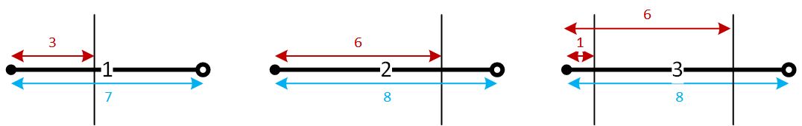
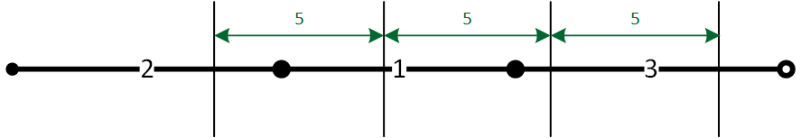

# Антенна

Для связи с Землёй членам экспедиции на Марс необходимо собрать антенну. Антенна в разобранном состоянии представляет собой n фрагментов, $i$-й фрагмент представляет собой штангу длиной $s_i$ сантиметров, на которой закреплены $m_i$ перекладин. Каждый фрагмент содержит хотя бы одну перекладину.
У каждой штанги есть начало, в котором расположен штекер, и конец, в котором расположено гнездо. Любые две штанги можно последовательно соединить, присоединив начало одной к концу другой. Для каждой перекладины известно расстояние от начала её штанги в сантиметрах. Для $i$-го фрагмента это расстояние может быть от 0 до $s_i$, значение 0 означает, что перекладина находится непосредственно в начале штанги, значение $s_i$ — что она находится непосредственно в конце штанги.
Толщиной перекладин и размерами штекера и гнезда следует пренебречь.
На рисунке показаны три фрагмента антенны из первого примера и отмечены расстояния от
начала штанги до перекладины.

Чтобы корректно собрать антенну, необходимо соединить в некотором порядке все $n$ фрагментов, при этом расстояние между любыми двумя соседними перекладинами должно быть одинаковым.
На рисунке показан корректный способ соединить фрагменты в первом примере.

К сожалению, члены экспедиции забыли инструкцию по сборке антенны на Земле, а передать её на Марс не представляется возможным — ведь антенна ещё не собрана. Помогите исследователям!
Требуется определить, в каком порядке необходимо соединить фрагменты антенны, чтобы установить связь с Землей

## Формат входных данных

В первой строке дано одно число n — количество фрагментов $(1 \leq n \leq 100 000)$.
Далее дано описание n фрагментов. В первой строке описания фрагмента даны два целых числа
$m_i$ и $s_i$ — количество перекладин и длина штанги в $i$-м фрагменте $(1 \leq m_i \leq 100 000, 0 \leq s_i \leq 10^9)$.
В следующей строке даны $m_i$ целых чисел $p_i$, $j$ — позиции перекладин, $p_i$, $$ равно расстоянию в
сантиметрах от начала штанги до $j$-й перекладины на ней $(0 \leq p_{i,1} < p_{i,2} < ... < p_{i,m_i} \leq s_i)$.
Сумма всех $m_i$ не превышает 100 000.

## Примеры

<table>
<tr>
<th>Стандартный ввод</th>
<th>Стандартный вывод</th>
</tr>
<tr>
<td>3 1 7 3 1 8 6 2 8 1 6</td>
<td>Yes 2 1 3</td>
</tr>
<tr>
<td>1 1 7 5</td>
<td>Yes 1</td>
</tr>
<tr>
<td>1 3 10 2 5 9</td>
<td>No</td>
</tr>
<tr>
<td>3 1 5 3 1 3 3 1 6 3</td>
<td>No</td>
</tr>
<tr>
<td>4 1 5 0 1 0 0 1 3 3 1 0 0</td>
<td>Yes 3 2 4 1</td>
</tr>
</table>